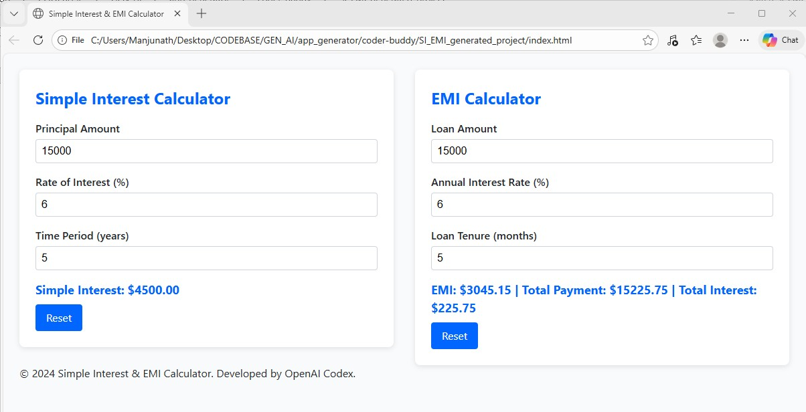
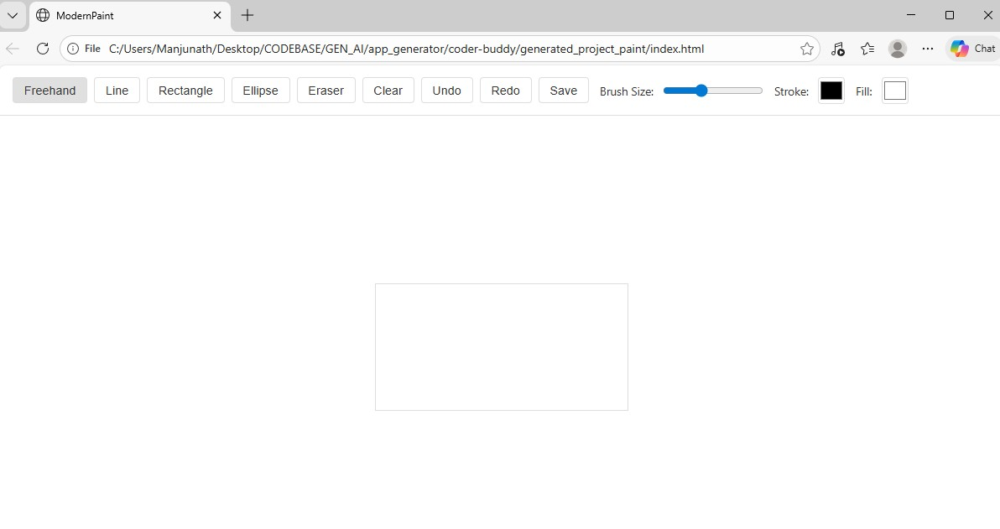

# CodeArchitect AI

### Autonomous Project Builder & Software Engineer

> Transform natural-language ideas into complete, production-ready software projects using Agentic AI.


---

## Overview

**CodeArchitect AI** is an autonomous AI software engineer that converts simple natural-language prompts into fully functional software projects.

Inspired by modern AI engineering systems such as Devin and Lovable, CodeArchitect AI doesn't just generate code snippets—it plans, designs, structures, and builds complete applications through a multi-agent workflow.

Simply describe what you want to build, and CodeArchitect AI handles the rest.

```bash
python main.py "Create a responsive calculator web application"
```

---

## What CodeArchitect AI Does

Given a prompt, the system automatically:

* Understands project requirements
* Creates a development plan
* Selects the appropriate technology stack
* Designs the project architecture
* Generates source code
* Creates project files and folders
* Refines implementation iteratively
* Produces a runnable application

---

## Agent Architecture

CodeArchitect AI is powered by a multi-agent workflow built with LangGraph.

```text
User Prompt
     │
     ▼
┌─────────────────┐
│ Planner Agent   │
└─────────────────┘
     │
     ▼
┌─────────────────┐
│ Architect Agent │
└─────────────────┘
     │
     ▼
┌─────────────────┐
│ Coder Agent     │
└─────────────────┘
     │
     ▼
Generated Project
```

---

## Core Agents

### Planner Agent

Responsible for understanding the user's intent and transforming it into a structured engineering plan.

**Responsibilities**

* Requirement Analysis
* Feature Identification
* Technology Selection
* Project Scoping
* File Structure Planning

---

### Architect Agent

Acts as a senior software architect by converting plans into implementation-ready specifications.

**Responsibilities**

* System Design
* Component Architecture
* Module Breakdown
* File-Level Instructions
* Development Strategy

---

### Coder Agent

Implements and refines the project autonomously.

**Responsibilities**

* Code Generation
* File Creation
* Refactoring
* Error Correction
* Iterative Improvements

---

## Key Features

### Agentic Planning

Transforms vague user ideas into structured engineering workflows.

### Architectural Reasoning

Designs scalable project structures before writing code.

### Iterative Development

Continuously improves generated code until project completion.

### Automatic File Generation

Creates complete project directories and source files automatically.

### Tool-Enabled Execution

Interacts with the local filesystem using controlled tools.

### Visual Agent Debugging

Trace and inspect agent execution through LangGraph debugging workflows.

### Structured Outputs

Uses Pydantic schemas to ensure predictable and reliable outputs.

---

## Technology Stack

| Category             | Technology       |
| -------------------- | ---------------- |
| Agent Framework      | LangGraph        |
| LLM Framework        | LangChain        |
| LLM Provider         | Groq Cloud       |
| Programming Language | Python           |
| Validation           | Pydantic         |
| Package Manager      | UV               |
| Debugging            | Agentic Debugger |

---

## Installation

### Clone Repository

```bash
git clone https://github.com/your-username/codearchitect-ai.git
cd codearchitect-ai
```

### Install Dependencies

```bash
uv sync
```

### Configure Environment Variables

Create a `.env` file:

```env
GROQ_API_KEY=your_api_key
```

---

## Usage

### Example 1

```bash
python main.py "Create a responsive calculator web application"
```

### Example 2

```bash
python main.py "Build a SIMPLE and COMPOUND INTEREST calculator with local storage"
```

### Example 3

```bash
python main.py "Create an AI-powered expense tracker with charts and analytics"
```

---

## Example Outputs

### Generated Application



### Generated Project Structure



---

## Roadmap

* Multi-Agent Collaboration
* Automated Testing Agent
* Deployment Agent
* Docker Support
* CI/CD Pipeline Generation
* Full-Stack Application Generation
* Mobile App Development Support
* Autonomous Bug Fixing

---

## Disclaimer

This project is intended for educational and research purposes.

Generated code should be reviewed, tested, and validated before production deployment.

---

## Developer

**Darshan Kamate**

Email: [kamatedarshan5@gmail.com](mailto:kamatedarshan5@gmail.com)

Phone: +91 9353675710

LinkedIn: https://www.linkedin.com/in/darshankamate

---

### If you find this project useful, consider giving it a star.
